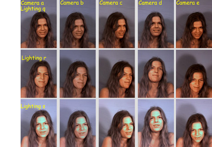
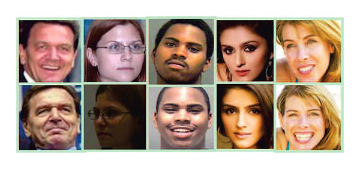
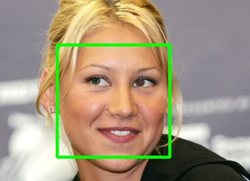
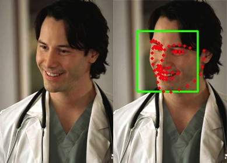
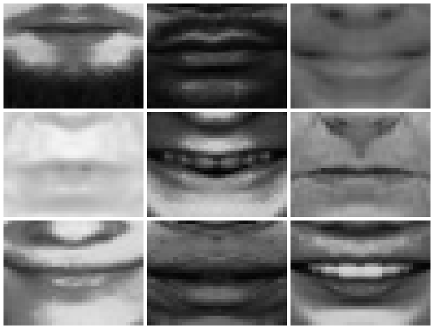
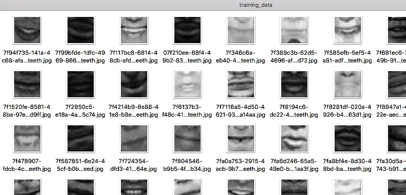
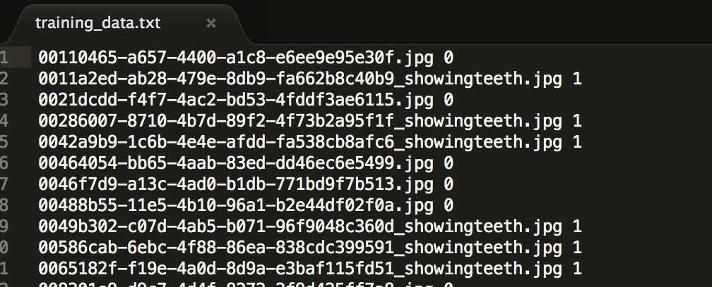
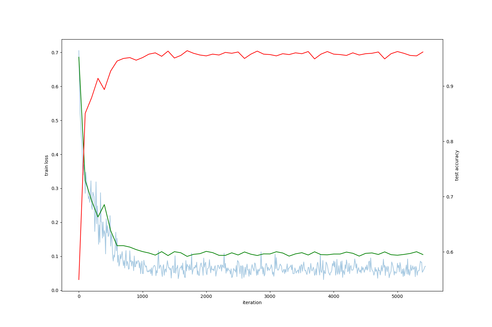
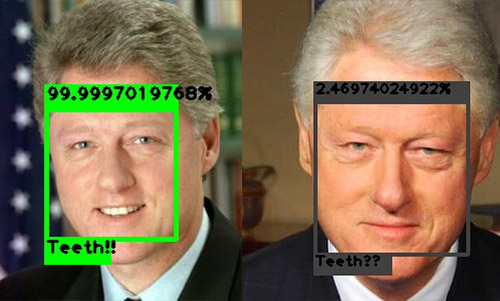
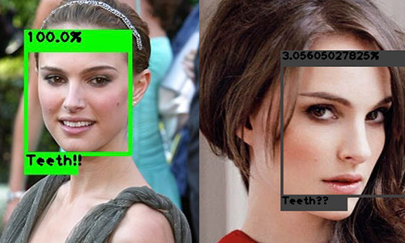

In this blog post, you will learn how to create a complete machine learning pipeline that solves the problem of telling whether or not a person in a picture is showing the teeth, we will see the main challenges that this problem imposes and tackle some common problems that will arise in the process.
By using a combination of Opencv libraries for face detection along with our own convolutional neural network for teeth recognition we will create a very capable system that could handle unseen data without losing significative performance. For quick prototyping, we are going to use the the Caffe deep learning framework, but you can use other cool frameworks like TensorFlow or Keras.

At the end of this post our trained convolutional neural network will be able to detect teeth on real video with a very good precision rate!

{: .center}

*Obama's teeth being detected by our conv net!*

The overall steps that will involve creating the teeth detector pipeline are:
* Finding the correct datasets then adapting those datasets to the problem
    * Labeling the data accordingly ( 1 for showing teeth, 0 not showing teeth)
    * Detecting the face region in an image
    * Detecting the principal landmarks on the face
    * Transforming the face with the detected landmarks to have a "frontal face" transformation
    * Slicing the relevant parts of the image
    * Easing the data for training by applying histogram equalization
* Augmenting the data
* Setting up the convolutional neural network in Caffe
* Training and debugging the overall system
* Testing the model with unseen data

# Finding a dataset
## Muct database
We are going to choose an open dataset called **MUCT** database [http://www.milbo.org/muct/](http://www.milbo.org/muct/){:target="_blank"}, this dataset contains 3755 unlabeled faces in total, all the images were taken in the same studio with the same background but with different lighting and camera angles.

{: .center}

*Muct database image variations, source http://www.milbo.org/muct/*

Because of manual labeling constraints only a subset of the dataset called muct-a-jpg-v1.tar.gz will be used, this file contains 751 faces in total, although this is a small number for training the machine learning model, it is possible to obtain good results using data augmentation techniques combined with a powerful convolutional neural network model, the reason for choosing this limited subset of data is because at some point in the process is necessary to do manual labeling for each picture, but note that it is always encouraged to label more data to obtain better results, in fact, you could have much better results than the final model of this posts by taking some time to label much more data and re-train the model.

## LFW database
To have more variety on the data we are going to use the **Labeled Faces in the Wild** database too [http://vis-www.cs.umass.edu/lfw/](http://vis-www.cs.umass.edu/lfw/){:target="_blank"}, this dataset contains 13.233 images of unlabeled faces in total, this database has a lot more variety because it contains faces of people in different situations all the images are gathered directly from the web. Similarly, for the LFW database, we are not going to use only 1505 faces for training.

{: .center}

*LFW database image samples, source http://vis-www.cs.umass.edu/lfw/*

# Labeling the data
Labeling the data is a manual and cumbersome process but necessary, we have to label images from the two face databases, we will label all the faces with the value 1 if the face is showing the teeth or 0 otherwise, the label will be stored on the filename of each image file. 

To recap:
For the MUCT database, we are going to label 751 faces.
For the LFW database, we are going to label 1505 faces.
So we have a total of 2256 unique faces with different expressions, some of them are showing the teeth and some not.

To speed up manual labeling a bit, you can use this simple tool [ImageBinaryTool](https://github.com/juanzdev/ImageBinaryLabellingTool){:target="_blank"} for quick labeling using hotkeys, the tool will read all the images in a folder and will start asking you to put the binary value, if you push the Y key on your keyboard it will add to the existing filename the label _showingteeth and pass to the next image, if you want to use this tool for your purposes feel free to pull it from git hub and modify it to suite your needs. 

{: .center}

*Labelling images using the binary labelling tool*

Note:
Note that these labeled images are not our training set because we have such small data set (2256 images) we need to get rid of unnecessary noise in the images by detecting the face region by using some face detection technique.

# Detecting the face region

## Face detection
There are different techniques for doing face detection, the most well known and accessible are Haar Cascades and Histogram of Gradients (HOG), OpenCV offers a nice and fast implementation of Haar Cascades and Dlib offers a more precise but slower face detection algorithm with HOG. After doing some testing with both libraries I found that DLib face detection is much more precise and accurate, the Haar approach gives me a lot of false positives, the problem with Dlib face-detection is that it is slow and using it in real video data can be a pain. At the end of the exercise, we ended up using both for different kind of situations. I recommend reading the excellent post [Machine Learning is fun](https://medium.com/@ageitgey/machine-learning-is-fun-part-4-modern-face-recognition-with-deep-learning-c3cffc121d78#.f8kxypipx){:target="_blank"}  by Adam Geitgey, most of the code shown here for face detection was based on his ideas.

By using the opencv libraries we can detect the region of the face, this is helpfull because we can discard unnecessary information and focus on our problem.

{: .center}

*Face detection in action*

Note:
You can also use a convolutional neural network for face detection, in fact, you will get much better results if you do, but for simplicity, we are going to stick with these out of the box libraries.

In Python, we are going to create two files, one for OpenCV face detection and one for DLib face detection. These files will receive an input image and will return the area where the face is present.

OpenCV implementation
```python
        def mouth_detect_single(self,image,isPath):

        if isPath == True:
            img = cv2.imread(image, cv2.IMREAD_UNCHANGED) 
        else:
            img = image
        
        img = histogram_equalization(img)
        gray_img1 = cv2.cvtColor(img, cv2.COLOR_BGR2GRAY) 
        faces = self.face_cascade.detectMultiScale(gray_img1, 1.3, 5)

        for (x,y,w,h) in faces:
            roi_gray = gray_img1[y:y+h, x:x+w]
            eyes = self.eye_cascade.detectMultiScale(roi_gray)
            if(len(eyes)>0):
                p = x 
                q = y
                r = w
                s = h
                face_region = gray_img1[q:q+s, p:p+r]
                face_region_rect = dlib.rectangle(long(q),long(p),long(q+s),long(p+r))
                rectan = dlib.rectangle(long(x),long(y),long(x+w),long(y+h))
                shape = self.md_face(img,rectan)
                p2d = np.asarray([(shape.part(n).x, shape.part(n).y,) for n in range(shape.num_parts)], np.float32)
                rawfront, symfront = self.fronter.frontalization(img,face_region_rect,p2d)
                face_hog_mouth = symfront[165:220, 130:190]
                gray_img = cv2.cvtColor(face_hog_mouth, cv2.COLOR_BGR2GRAY) 
                crop_img_resized = cv2.resize(gray_img, (IMAGE_WIDTH, IMAGE_HEIGHT), interpolation = cv2.INTER_CUBIC)
                #cv2.imwrite("../img/output_test_img/mouthdetectsingle_crop_rezized.jpg",gray_img)
                return crop_img_resized,rectan.left(),rectan.top(),rectan.right(),rectan.bottom()
        else:
            return None,-1,-1,-1,-1
```

DLIB Implementation using histogram of gradients
```python
    def mouth_detect_single(self,image,isPath):

        if isPath == True:
            img = cv2.imread(image, cv2.IMREAD_UNCHANGED) 
        else:
            img = image
    
        img = histogram_equalization(img)
        facedets = self.face_det(img,1) #Histogram of gradients
        if len(facedets) > 0:
            facedet_obj= facedets[0]
            shape = self.md_face(img,facedet_obj)
            p2d = np.asarray([(shape.part(n).x, shape.part(n).y,) for n in range(shape.num_parts)], np.float32)
            rawfront, symfront = self.fronter.frontalization(img,facedet_obj,p2d)
            symfront_bgr = cv2.cvtColor(symfront, cv2.COLOR_RGB2BGR) 
            face_hog_mouth = symfront_bgr[165:220, 130:190] #get half-bottom part
            if(face_hog_mouth is not None):
                gray_img = cv2.cvtColor(face_hog_mouth, cv2.COLOR_BGR2GRAY) 
                crop_img_resized = cv2.resize(gray_img, (IMAGE_WIDTH, IMAGE_HEIGHT), interpolation = cv2.INTER_CUBIC)
              	return crop_img_resized,facedet_obj.left(),facedet_obj.top(),facedet_obj.right(),facedet_obj.bottom()
            else:
                return None,-1,-1,-1,-1
        else:
            return None,-1,-1,-1,-1
```
# Landmark detection and frontalization
Faces on images can have a lot of variation, they can be rotated at certain degree or they can have different perspectives because the picture was taken at different angles and positions. 

Simply detecting the face is not enough in our case because learning these multiple variations will require huge amounts of data, we need to have a standard way to see the faces this is we need to see the face always in the same position and perspective, to do this we need to extract landmarks from the face, landmarks are special points in the face that relate to specific relevant parts like the jaw, nose, mouth and eyes, with the detected face and the landmark points it is possible to **warp** the face image to have a frontal version of it, luckily for us landmark extraction and frontalization can be simplified a lot by using some dlib libraries.

```python
#landmark detector
shape = self.md_face(img,facedet_obj)
```

md_face receives the face region and will detect 68 landmark points using a previously trained model, with the landmark data we can make a warp transformation to the face using the landmarks as a guide to make the frontalization.

{: .center}

*Before and after landmark detection*

{: .center}

*Before and after landmark detection*

to warp the face using the landmark data we use a python ported code that use the frontalization techinque proposed by al Hassner, Shai Harel*, Eran Paz* and Roee Enbar  http://www.openu.ac.il/home/hassner/projects/frontalize/ and ported to python by Heng Yang, the complete code can be found at the end of this post:

```python
p2d = np.asarray([(shape.part(n).x, shape.part(n).y,) for n in range(shape.num_parts)], np.float32)
rawfront, symfront = self.fronter.frontalization(img,facedet_obj,p2d)
```

{: .center}

*Frontalized image with image slicing*

# Image slicing
Now that we have frontal faces we can make a simple vertical division to discard the top face region and keep only the bottom region that contains the mouths:

```python
rawfront, symfront = self.fronter.frontalization(img,facedet_obj,p2d)
face_hog_mouth = symfront[165:220, 130:190] #get half-bottom part
```

To generate all the mouth data you can run the script create_mouth_training_data.py

```bash
python create_mouth_training_data.py
```

{: .center}

*Frontalized mouths black and white will be our training data*

With those transformations in place, our net will receive inputs of the same part of the face for each image. The total output of this step will be 2256 mouths.

# Histogram Equalization
A usefull technique for highlighting the details on the image is to apply histogram equalization, note that this step is already applied on create_mouth_training_data.py:

```python
def histogram_equalization(img):
    img[:, :, 0] = cv2.equalizeHist(img[:, :, 0])
    img[:, :, 1] = cv2.equalizeHist(img[:, :, 1])
    img[:, :, 2] = cv2.equalizeHist(img[:, :, 2])
    return img
```

# Data Augmentation
As you recall, we have labeled only 751 images from the MUCT database and 1505 from the LFW database, this is just not enough data for learning to detect teeth, we need to gather more data somehow, the obvious solution is to label a couple of thousand images more, this is the **ideal** solution, having more data is always better but collecting it is time expensive, so for simplicity we are going to use data augmentation. We are going to make the following transformations to our set of mouth images to get almost 10x times more different images (23528 mouth images in total):

## Mirroring the mouths
For each mouth image, we are going to create a mirrored clone, this will give us twice the data.

```python
horizontal_img = cv2.flip( img, 0 )
```

## Rotating the mouths
For each mouth image we are going to make small rotations, specifically -30,-20,-10,+10,+20,+30 degrees, this will give us 6x times the data approx.


```python
for in_idx, img_path in enumerate(input_data_set):
    file_name = os.path.splitext(os.path.basename(img_path))[0]
    print(file_name)
    augmentation_number = 8
    initial_rot = -20
    #save original too
    path = output_folder+"/"+file_name+".jpg"
    copyfile(img_path, path)
    for x in range(1, augmentation_number):
        rotation_coeficient = x
        rotation_step=5
        total_rotation=initial_rot+rotation_step*rotation_coeficient
        #print(total_rotation)
        mouth_rotated = image_rotated_cropped(img_path,total_rotation)
        #resize to 50 by 50
        mouth_rotated = cv2.resize(mouth_rotated, (IMAGE_WIDTH, IMAGE_HEIGHT), interpolation = cv2.INTER_CUBIC)
        if generate_random_filename == 1:
            guid = uuid.uuid4()
            uid_str = guid.urn
            str_guid = uid_str[9:]
            path = ""
            if 'showingteeth' in img_path:
                path = output_folder+"/"+str_guid+"_showingteeth.jpg"
            else:
                path = output_folder+"/"+str_guid+".jpg"
            cv2.imwrite(path,mouth_rotated)
        else:
            path = ""
            if 'showingteeth' in img_path:
                path = output_folder+"/"+file_name+"_rotated"+str(x)+"_showingteeth.jpg"
            else:
                path = output_folder+"/"+file_name+"_rotated"+str(x)+".jpg"
            cv2.imwrite(path,mouth_rotated)

```

# Setting up the Convolutional neural network in Caffe
Finally! we are at the point where all our training data has significant amounts of information to learn the problem, the next step will be the core functionality of our machine learning pipeline, we are going to create a convolutional neural net that will learn the knowledge of **what a mouth showing a teeth** is, the following steps are required to correctly configure this convolutional neural network in caffe:

## Preparing the training set and validation set
Now that we have enough labeled mouths in place, we need to split it into two subsets, we are going to use the 80/20 rule, 80 percent (18828 mouth images in total) of our transformed data are going to be in training set and the 20 percent (4700 mouth images) are going to be in the validation set. The training data will be used during the training phase for our network learning and the validation set will be used to test the performance of the net during training, in this case, we have to move the mouth images to their respective folders located in training_data and validation_data.

{: .center}

*training set folder*

{: .center}

*validation set folder*

## Creating the LMDB file
With the mouth images located in the training and validation folders, we are going to generate two text files, each containing the path of the corresponding mouth images plus the label (1 or 0), these text files are needed because Caffe has a tool to generate LMDB files based on these.

```python
import caffe
import lmdb
import glob
import cv2
import uuid
from caffe.proto import caffe_pb2
import numpy as np
import os


train_lmdb = "../train_lmdb"
train_data = [img for img in glob.glob("../img/training_data/*jpg")]
val_data = [img for img in glob.glob("../img/validation_data/*jpg")]

myFile = open('../training_data.txt', 'w')

for in_idx, img_path in enumerate(train_data):
    head, tail = os.path.split(img_path)
    label = -1
    if 'showingteeth' in tail:
        label = 1
    else:
        label =0
    myFile.write(tail+" "+str(label)+"\n")

myFile.close()


f = open('../training_val_data.txt', 'w')

for in_idx, img_path in enumerate(val_data):
    head, tail = os.path.split(img_path)
    label = -1
    if 'showingteeth' in tail:
        label = 1
    else:
        label =0
    f.write(tail+" "+str(label)+"\n")

f.close()

```

{: .center}

*text file that has the path of the image plus the label, this will be required to generate the LMDB data*

To generate both training and validation LMDB files we run the following commands:

```bash
convert_imageset --gray --shuffle /devuser/Teeth/img/training_data/ training_data.txt train_lmdb
convert_imageset --gray --shuffle /devuser/Teeth/img/validation_data/ training_val_data.txt val_lmdb
```

## Extracting the mean data for the entire dataset
A common step in computer vision is to extract the mean data of the entire training dataset to ease the learning process during backpropagation, Caffe already has a library to calculate the mean data for us:

```bash
compute_image_mean -backend=lmdb train_lmdb mean.binaryproto
```

This will generate a file called mean.binaryproto, this file will have matrix data related to the overall mean of all our training set, this matrix will be subtracted during training to each and every one of our training examples, this helps to have a more reasonable scale for the inputs.

## Designing and implementing the convolutional neural network

Convnets are really good at image recognition because they can learn features automatically just by input-output associations, they are also very good at transformation invariances this is small changes in rotation and full changes in translation.
In machine learning, there are a set of well-known state-of-the-art architectures for image processing like AlexNet, VGGNet, Google Inception etc. If you follow that kind of architectures is almost guaranteed you will obtain the best results possible, for this case and for the sake of simplicity we are going to use a simplified version of these nets with much less convolutional layers, remember that in this particular case we are just trying to extract teeth features from the mouths and not entire concepts of the real world like AlexNet does, so a net with much less capacity will do fine for the task.

train_val_feature_scaled.prototxt
```json
name: "TeethNet"
layer {
  name: "data"
  type: "Data"
  top: "data"
  top: "label"
  include {
    phase: TRAIN
  }
  transform_param {
    scale: 0.00390625
    mean_file: "mean.binaryproto"
    mirror: false
    
  }
  data_param {
    source: "train_lmdb"
    batch_size: 256
    backend: LMDB
  }
}

layer {
  name: "data"
  type: "Data"
  top: "data"
  top: "label"
  include {
    phase: TEST
  }
  transform_param {
    scale: 0.00390625
    mean_file: "mean.binaryproto"
    mirror: false
  }
  data_param {
    source: "val_lmdb"
    batch_size: 256
    backend: LMDB
  }
}
layer {
  name: "conv1"
  type: "Convolution"
  bottom: "data"
  top: "conv1"
  param {
    lr_mult: 1
  }
  param {
    lr_mult: 2
  }
  convolution_param {
    num_output: 20
    kernel_size: 5
    stride: 1
    weight_filler {
      type: "xavier"
    }
    bias_filler {
      type: "constant"
    }
  }
}
layer {
  name: "pool1"
  type: "Pooling"
  bottom: "conv1"
  top: "pool1"
  pooling_param {
    pool: MAX
    kernel_size: 2
    stride: 2
  }
}
layer {
  name: "conv2"
  type: "Convolution"
  bottom: "pool1"
  top: "conv2"
  param {
    lr_mult: 1
  }
  param {
    lr_mult: 2
  }
  convolution_param {
    num_output: 50
    kernel_size: 5
    stride: 1
    weight_filler {
      type: "xavier"
    }
    bias_filler {
      type: "constant"
    }
  }
}
layer {
  name: "pool2"
  type: "Pooling"
  bottom: "conv2"
  top: "pool2"
  pooling_param {
    pool: MAX
    kernel_size: 2
    stride: 2
  }
}
layer {
  name: "ip1"
  type: "InnerProduct"
  bottom: "pool2"
  top: "ip1"
  param {
    lr_mult: 1
  }
  param {
    lr_mult: 2
  }
  inner_product_param {
    num_output: 500
    weight_filler {
      type: "xavier"
    }
    bias_filler {
      type: "constant"
    }
  }
}
layer {
  name: "relu1"
  type: "ReLU"
  bottom: "ip1"
  top: "ip1"
}

layer {
  name: "drop1"
  type: "Dropout"
  bottom: "ip1"
  top: "ip1"
  dropout_param {
    dropout_ratio: 0.5
  }
}

layer {
  name: "ip2"
  type: "InnerProduct"
  bottom: "ip1"
  top: "ip2"
  param {
    lr_mult: 1
  }
  param {
    lr_mult: 2
  }
  inner_product_param {
    num_output: 2
    weight_filler {
      type: "xavier"
    }
    bias_filler {
      type: "constant"
    }
  }
}
layer {
  name: "loss"
  type: "SoftmaxWithLoss"
  bottom: "ip2"
  bottom: "label"
  top: "loss"
}
layer {
  name: "accuracy"
  type: "Accuracy"
  bottom: "ip2"
  bottom: "label"
  top: "accuracy"
  include {
    phase: TEST
  }
}
```

deploy.prototxt

```json
name: "TeethNet"
layer {
  name: "input"
  type: "Input"
  top: "data"
  input_param {
    shape {
      dim: 1
      dim: 1
      dim: 32
      dim: 32
    }
  }
}
layer {
  name: "conv1"
  type: "Convolution"
  bottom: "data"
  top: "conv1"
  param {
    lr_mult: 1
  }
  param {
    lr_mult: 2
  }
  convolution_param {
    num_output: 20
    kernel_size: 5
    stride: 1
    weight_filler {
      type: "xavier"
    }
    bias_filler {
      type: "constant"
    }
  }
}
layer {
  name: "pool1"
  type: "Pooling"
  bottom: "conv1"
  top: "pool1"
  pooling_param {
    pool: MAX
    kernel_size: 2
    stride: 2
  }
}
layer {
  name: "conv2"
  type: "Convolution"
  bottom: "pool1"
  top: "conv2"
  param {
    lr_mult: 1
  }
  param {
    lr_mult: 2
  }
  convolution_param {
    num_output: 50
    kernel_size: 5
    stride: 1
    weight_filler {
      type: "xavier"
    }
    bias_filler {
      type: "constant"
    }
  }
}
layer {
  name: "pool2"
  type: "Pooling"
  bottom: "conv2"
  top: "pool2"
  pooling_param {
    pool: MAX
    kernel_size: 2
    stride: 2
  }
}
layer {
  name: "ip1"
  type: "InnerProduct"
  bottom: "pool2"
  top: "ip1"
  param {
    lr_mult: 1
  }
  param {
    lr_mult: 2
  }
  inner_product_param {
    num_output: 500
    weight_filler {
      type: "xavier"
    }
    bias_filler {
      type: "constant"
    }
  }
}
layer {
  name: "relu1"
  type: "ReLU"
  bottom: "ip1"
  top: "ip1"
}
layer {
  name: "drop1"
  type: "Dropout"
  bottom: "ip1"
  top: "ip1"
  dropout_param {
    dropout_ratio: 0.5
  }
}
layer {
  name: "ip2"
  type: "InnerProduct"
  bottom: "ip1"
  top: "ip2"
  param {
    lr_mult: 1
  }
  param {
    lr_mult: 2
  }
  inner_product_param {
    num_output: 2
    weight_filler {
      type: "xavier"
    }
    bias_filler {
      type: "constant"
    }
  }
}
layer {
  name: "softmax"
  type: "Softmax"
  bottom: "ip2"
  top: "pred"
}

```

solver.prototxt
```json
net: "model/train_val_feature_scaled.prototxt"
test_iter: 5
test_interval: 100
base_lr: 0.1
lr_policy: "step"
gamma: 0.1
stepsize: 500
display: 10
max_iter: 10000
momentum: 0.9
weight_decay: 0.0005
snapshot: 100
snapshot_prefix: "model_snapshot/snap_fe"
solver_mode: CPU
```

## CNN Architecture

{: .center}


# Training and debugging the overall system

## Training the neural network
With the architecture in place we are ready to start learning the model, we are going to execute the caffe train command to start the training process, note that all the data from the LMDB files will flow through the data layer of the network along with the labels, also the backpropagation learning procedure will take place at the same time, and by using gradient descent optimization, the error rate will decrease in each iteration.

```bash
caffe train --solver=model/solver_feature_scaled.prototxt 2>&1 | tee logteeth_ult_fe_2.log
```

## Plotting loss vs iterations 
A good way to measure the performance of the learning in our convolutional neural network is to plot the loss of the training and validation set vs the number of iterations.

Note:
To create the plot is necessary to pre-process the .log file generated during the training phase, to do this execute:

```bash
python /Users/juank/Dev/caffe/tools/extra/parse_log.py logteeth.log .
```
this command will generate two plain text files containing all the metrics for the validation set vs iterations and the training set vs iterations.
The next step is to plot the data using the provided Caffe tool for plotting:

```bash
python plot_diag.py 
```

{: .center}

*Loss vs Iterations, training with learning rate 0.01 after 5000 iterations*

Note:
It looks like we are stuck in local minima! you can tell this just by looking at this useful graph, note that the validation error won't go down and it looks like the best it can do is 30% error on the validation set! this is not so good performance, a useful technique is to start with a bigger learning rate and then start decreasing it after a few iterations, let's try with learning rate 0.1

{: .center}

*Loss vs Iterations, training with learning rate 0.1 after 5000 iterations*

Training with learning rate 0.1 (much better!)
Look how we overcome the local minima at the beginning then we found a much deeper region on the loss space just by incrementing the initial learning rate at the very start, be careful because this doesn't always works and is truly a problem dependant situation.

## Deploying the trained convnet
Now that we have our network trained with a reasonably good performance on the validation set it is time to start testing it with new unseen data.
To do this we are going to use the caffe library for python, and we are going to create a simple python script that will load the deploy.prototxt architecture of our convnet, along with this architecture we are going to feed it with the trained weights located on the .caffemodel file.

teeth_cnn.py
```python
IMAGE_WIDTH = 32
IMAGE_HEIGHT = 32

class teeth_cnn:
	
	def __init__(self):
		self.init_net()

   	def init_net(self):
   		self.mean_blob = self.mean_blob_fn()
   		self.mean_array = np.asarray(self.mean_blob.data, dtype=np.float32).reshape((self.mean_blob.channels, self.mean_blob.height, self.mean_blob.width))
   		self.mean_array = self.mean_array*0.00390625
   		self.net = caffe.Net('../model/deploy.prototxt',1,weights='../model_snapshot/snap_fe_iter_8700.caffemodel')
   		self.net.blobs['data'].reshape(1,1, IMAGE_WIDTH, IMAGE_HEIGHT)
   		self.transformer = caffe.io.Transformer({'data': self.net.blobs['data'].data.shape})
   		self.transformer.set_mean('data', self.mean_array)
   		self.transformer.set_transpose('data', (2,0,1))
   		self.transformer.set_raw_scale('data', 0.00390625)

	def mean_blob_fn(self):
		mean_blob = caffe_pb2.BlobProto()
		with open('../mean.binaryproto') as f:
			mean_blob.ParseFromString(f.read())

		return mean_blob


	def predict(self,image,mouth_detector):
		img = image
		mouth_pre,x,y,w,h = mouth_detector.mouth_detect_single(img,False)

		if mouth_pre is not None:
			mouth_pre = mouth_pre[:,:,np.newaxis]
			mouth = self.transformer.preprocess('data', mouth_pre)
			self.net.blobs['data'].data[...] = mouth
			out = self.net.forward()
			#pred = out['pred'].argmax()
			if(out['pred'][0][1]>0.70):
				return 1,out['pred'],x,y,w,h
			else:
				return 0,out['pred'],x,y,w,h
		else:
			return -1,0,0,0,0,0
```

predict.py
```python
BULK_PREDICTION = 0 #Set this to 0 to classify individual files
#if bulk prediction is set to 1 the net will predict all images on the configured path
test_set_folder_path = "../img/original_data/b_labeled"
#all the files will be moved to a showing teeth or not showing teeth folder on the test_output_result_folder_path path
test_output_result_folder_path = "../result" 
#if BULK_PREDICTION = 0 the net will classify only the file specified on individual_test_image
individual_test_image = "../ana.jpg"
#read all test images
original_data_set = [img for img in glob.glob(test_set_folder_path+"/*jpg")]

mouth_detector_instance = mouth_detector()
teeth_cnn_instance = teeth_cnn()

if BULK_PREDICTION==0:
	img = cv2.imread(individual_test_image, cv2.IMREAD_UNCHANGED)
	result,prob,xf,yf,wf,hf = teeth_cnn_instance.predict(img,mouth_detector_instance)
	print(individual_test_image)
	print("Prediction:")
	print(result)
	print("Prediction probabilities")
	print(prob)
else:
	files = glob.glob(test_output_result_folder_path+'/not_showing_teeth/*')
	for f in files:
		os.remove(f)

	files = glob.glob(test_output_result_folder_path+'/showing_teeth/*')
	for f in files:
		os.remove(f)
	
	#performance variables
	total_samples = 0
	total_positives_training = 0
	total_negatives_training = 0
	true_positive = 0
	true_negative = 0
	false_positive = 0
	false_negative = 0
	
	for in_idx, img_path in enumerate(original_data_set):
		total_samples = total_samples + 1
		head, tail = os.path.split(img_path)
		img = cv2.imread(img_path, cv2.IMREAD_UNCHANGED)
		result,prob,xf,yf,wf,hf = teeth_cnn_instance.predict(img,mouth_detector_instance)
		print("Prediction:")
		print(result)
		print("Prediction probabilities")
		print(prob)
		if(result==1):
			if 'showingteeth' in tail:
				total_positives_training = total_positives_training + 1
				true_positive = true_positive + 1
			else:
				total_negatives_training = total_negatives_training + 1
				false_positive = false_positive + 1

			path = test_output_result_folder_path+"/showing_teeth/"+tail
			shutil.copy2(img_path, path)
		else:
			if 'showingteeth' in tail:
				total_positives_training = total_positives_training + 1
				false_negative = false_negative + 1
			else:
				total_negatives_training = total_negatives_training + 1
				true_negative = true_negative + 1

			path = test_output_result_folder_path+"/not_showing_teeth/"+tail
			shutil.copy2(img_path, path)

	print "Total samples %d" %total_samples
 	print "True positives %d" %true_positive
 	print "False positives %d" %false_positive
	print "True negative %d" %true_negative
	print "False negative %d" %false_negative
	
	accuracy = (true_negative + true_positive)/total_samples
	recall = true_positive / (true_positive + false_negative)
	precision = true_positive / (true_positive + false_positive)
	f1score = 2*((precision*recall)/(precision+recall))

	print "Accuracy  %.2f" %accuracy
	print "Recall  %.2f" %recall
	print "Precision  %.2f" %precision
	print "F1Score  %.2f" %f1score
```
Note:
Note that this script will test our trained net with new single image if the parameter BULK_PREDICTION is set to zero, otherwise it will make a bulk prediction over an entire folder of images and will move the ones he thinks are showing the teeth to the corresponding folder, you can play with this behaviour based o your needs.

## Testing the trained model with unseen data

## Testing for a single image

First I'm going to test the net with some individual unseen images to measure individual results, to do this please modify the parameters shown below:

```python
BULK_PREDICTION = 0 #Set this to 0 to classify individual files
#if BULK_PREDICTION = 0 the net will classify only the file specified on individual_test_image
individual_test_image = "../test_image.jpg"
```
Testing on individual images:

{: .center}

*predicting teeth on a single image*

{: .center}

*predicting teeth on a single image*

## Testing for a bunch of images (Bulk testing)

Now I'm going to test over an entire folder of unseen images, we have to modify the parameters shown below:

```python
BULK_PREDICTION = 1 #Set this to 0 to classify individual files
#if bulk prediction is set to 1 the net will predict all images on the configured path
test_set_folder_path = "../img/original_data/b_labeled"
#all the files will be moved to a showing teeth or not showing teeth folder on the test_output_result_folder_path path
test_output_result_folder_path = "../result"
```

the folder called b_labeled have images taken on different angles of the sampled MUCT dataset so, see this as the test set but with labels on it, I previously labeled these images using the manual labeling tool, this step is useful because we can calculate how good or how bad the net is behaving after the prediction phase.

You can look back at the entire script to know how the following code segment relates to the code, basically, we are calculating the F1score to know how good or bad our model is doing:

```python
accuracy = (true_negative + true_positive)/total_samples
recall = true_positive / (true_positive + false_negative)
precision = true_positive / (true_positive + false_positive)
f1score = 2*((precision*recall)/(precision+recall))
```

So to start testing the net by classifying the b_labeled folder or classifying a single image, execute:

```bash
python predict.py
```

Note that this script will read all the images specified on the input folder and will pass one by one each image to our trained convolutional neural network and based on the prediction probability the image will be copied to the showing_teeth or not_showing_teeth folder.
At the end of the execution of the process the accuracy, precision, recall and f1score are calculated:

{: .center}
|                | Predicted Negative | Predicted Positive |
|----------------|--------------------|--------------------|
| Negative Cases | TN: 283            | FP: 18             |
| Positive Cases | FN: 54             | TP: 396            |

* Total samples 751
* True positives 396
* False positives 18
* True negative 283
* False negative 54
* Accuracy  0.90
* Recall  0.88
* Precision  0.96
* F1-score  0.92

The overall performance of the model is pretty good but not perfect, note that we have a couple of false positives and false negatives but is a reasonable ratio for the problem at the end.

By looking at the performance metrics we can start experimenting with different hyperparameters or different modifications of our pipeline and always have a point of comparison to see if we are doing better or not.

## Testing our net with real video!
Now lets have some fun by passing a fragment of the Obama's presidential speech to the trained net to see if Barack Obama is showing his teeth to the camera or not, note that in each frame of the video the trained convolutional neural network needs to make a prediction, the output of the prediction will be rendered on a new video along with the face detection boundary.

```python
cv2.namedWindow("preview")
vc = cv2.VideoCapture(0)
#vc.set(3,500)
#vc.set(4,500)
#vc.set(5,30)
if vc.isOpened(): # try to get the first frame
    rval, frame = vc.read()
else:
    rval = False

mouth_detector_instance = mouth_detector()
teeth_cnn_instance = teeth_cnn()

size = cv2.getTextSize("Showing teeth", cv2.FONT_HERSHEY_PLAIN, 2, 1)[0]
x,y = (50,250)

while rval:
	rval, frame = vc.read()
	copy_frame = frame.copy()
	result,prob,xf,yf,wf,hf = teeth_cnn_instance.predict(copy_frame,mouth_detector_instance)
	print prob
	if result is not None:
	    if(result == 1):
	    	cv2.rectangle(frame, (xf,yf),(wf,hf),(0,255,0),4,0)
	    	prob_round = prob[0][1]*100
	    	print prob_round
	    	cv2.rectangle(frame, (xf-2,yf-25),(wf+2,yf),(0,255,0),-1,0)
	    	cv2.rectangle(frame, (xf-2,hf),(xf+((wf-xf)/2),hf+25),(0,255,0),-1,0)
	    	cv2.putText(frame, "Teeth!!",(xf,hf+14),cv2.FONT_HERSHEY_PLAIN,1.2,0,2)
	    	cv2.putText(frame, str(prob_round)+"%",(xf,yf-10),cv2.FONT_HERSHEY_PLAIN,1.2,0,2)
	    	#out.write(frame)
	    	print "SHOWING TEETH!!!"
	    elif(result==0):
	    	cv2.rectangle(frame, (xf,yf),(wf,hf),(64,64,64),4,0)
	    	prob_round = prob[0][1]*100
	    	print prob_round
	    	cv2.rectangle(frame, (xf-2,yf-25),(wf+2,yf),(64,64,64),-1,0)
	    	cv2.rectangle(frame, (xf-2,hf),(xf+((wf-xf)/2),hf+25),(64,64,64),-1,0)
	    	cv2.putText(frame, "Teeth??",(xf,hf+14),cv2.FONT_HERSHEY_PLAIN,1.2,0,2)
	    	cv2.putText(frame, str(prob_round)+"%",(xf,yf-10),cv2.FONT_HERSHEY_PLAIN,1.2,0,2)

	cv2.imshow("preview", frame)
	cv2.waitKey(1)
cv2.destroyWindow("preview")

```

# Having fun
By running the script above you can test the trained network with any video you want:

{: .center}

*Obama's teeth being detected by our conv net!*
